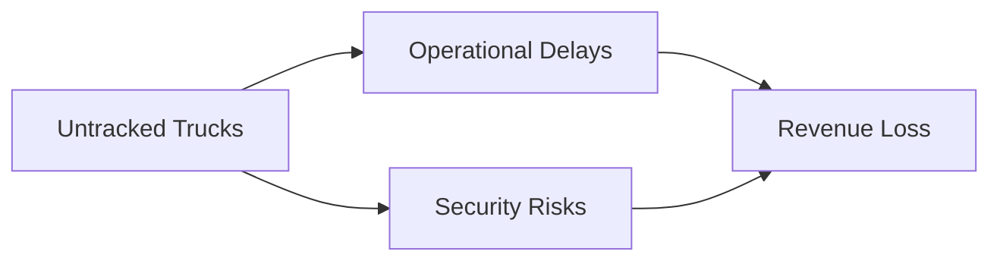

# 🚛 CoalTrack AI: Real-Time Coal Truck Detection

[](https://opensource.org/licenses/MIT)
[](https://www.python.org/downloads/)
[](https://pytorch.org/)
[](https://pjreddie.com/darknet/yolo/)

> 🌟 Real-time coal truck detection system powered by YOLOv3, optimized for mining operations.

## 📖 Table of Contents
- [Overview](#overview)
- [Key Features](#key-features)
- [Installation](#installation)
- [Quick Start](#quick-start)
- [Project Structure](#project-structure)
- [Model Architecture](#model-architecture)
- [Training](#training)
- [Results](#results)
- [Contributing](#contributing)
- [License](#license)
- [Citation](#citation)
- [Contact](#contact)

## 🎯 Overview

CoalTrack AI is a state-of-the-art object detection system designed specifically for mining operations. Built on YOLOv3 architecture, it provides real-time tracking of coal-carrying trucks, helping mining companies optimize their logistics and prevent losses.

### The Problem


### Our Solution
- 🚀 Real-time detection
- 🎯 High accuracy in challenging conditions
- 📱 Edge device deployment
- 📊 Comprehensive analytics

## ✨ Key Features

| Feature | Description |
|---------|------------|
| Real-Time Processing | < 30ms inference time per frame |
| Multi-Scale Detection | Efficient detection at various distances |
| Edge Deployment | Optimized for NVIDIA Jetson devices |
| Environmental Adaptation | Robust performance in dust and poor lighting |
| Custom Dataset | Trained on real mining operation footage |

## 🛠️ Installation

```bash
# Clone the repository
git clone https://github.com/yourusername/coaltrack-ai.git

# Navigate to the project directory
cd coaltrack-ai

# Create a virtual environment
python -m venv venv

# Activate the virtual environment
source venv/bin/activate  # Linux/Mac
.\venv\Scripts\activate   # Windows

# Install dependencies
pip install -r requirements.txt
```

## 🚀 Quick Start

```python
from coaltrack import CoalDetector

# Initialize detector
detector = CoalDetector(
    weights_path='weights/best.pt',
    device='cuda'  # or 'cpu'
)

# Run detection on image
results = detector.detect('path/to/image.jpg')

# Run detection on video stream
detector.start_stream(source=0)  # 0 for webcam
```

## 📁 Project Structure

```
coaltrack-ai/
├── coaltrack/
│   ├── __init__.py
│   ├── models/
│   │   ├── darknet.py
│   │   └── yolo.py
│   ├── utils/
│   │   └── detection.py
│   └── train.py
├── data/
│   └── coal_trucks/
├── configs/
│   └── yolov3.yaml
├── weights/
└── tests/
```

## 🧠 Model Architecture

Our implementation uses Darknet-53 as the backbone:

```
YOLOv3 Architecture
├── Darknet-53 Backbone
│   ├── 53 convolutional layers
│   └── Residual connections
├── Feature Pyramid Network
└── Multi-scale Detection Heads
```

## 📈 Training

Train your own model:

```bash
python train.py \
    --data configs/coal_trucks.yaml \
    --epochs 100 \
    --batch-size 16 \
    --img-size 416
```

### Training Parameters

| Parameter | Value | Description |
|-----------|-------|-------------|
| Learning Rate | 0.001 | Initial learning rate |
| Batch Size | 16 | Mini-batch size |
| Image Size | 416x416 | Input resolution |
| Epochs | 100 | Training iterations |

## 🎉 Results

Performance metrics on our test set:

| Metric | Value |
|--------|-------|
| mAP@0.5 | 91.2% |
| FPS (RTX 3080) | 60+ |
| FPS (Jetson Nano) | 20+ |

## 🤝 Contributing

We welcome contributions! Please see our [Contributing Guidelines](CONTRIBUTING.md) for details.

1. Fork the repository
2. Create your feature branch (`git checkout -b feature/AmazingFeature`)
3. Commit your changes (`git commit -m 'Add some AmazingFeature'`)
4. Push to the branch (`git push origin feature/AmazingFeature`)
5. Open a Pull Request

## 📄 License

This project is licensed under the MIT License - see the [LICENSE](LICENSE) file for details.

## 📚 Citation

```bibtex
@software{coaltrack_ai2024,
  author = {Your Name},
  title = {CoalTrack AI: Real-Time Coal Truck Detection},
  year = {2024},
  publisher = {GitHub},
  url = {https://github.com/yourusername/coaltrack-ai}
}
```

## 📫 Contact

- **Project Maintainer**: Your Name - [@yourusername](https://github.com/yourusername)
- **Email**: your.email@example.com
- **Project Link**: [https://github.com/yourusername/coaltrack-ai](https://github.com/yourusername/coaltrack-ai)

---
<p align="center">
  Made with ❤️ by Team QuantumSenses
</p>
