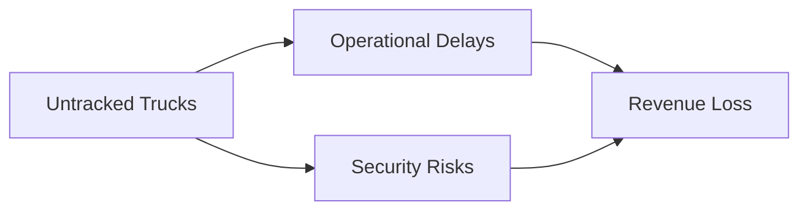

# 🚛 CoalDetector - Object Detection Model

[](https://opensource.org/licenses/MIT)
[](https://www.python.org/downloads/)
[](https://pytorch.org/)
[](https://pjreddie.com/darknet/yolo/)

> 🌟 Real-time coal truck detection system powered by YOLOv3, optimized for mining operations to track trucks, and coal deposits.
> ### Made for the Qualcomm VisionX Hackathon from IITB Techfest'24. 

## 📖 Table of Contents
- [TODO](#todo)
- [Overview](#overview)
- [Key Features](#key-features)
- [Installation](#installation)
- [Quick Start](#quick-start)
- [Project Structure](#project-structure)
- [Model Architecture](#model-architecture)
- [Training](#training)
- [Results](#results)
- [Contact](#contact)

## 📃 TODO

- [ ] Annotating full data and making dataset public on kaggle.
- [ ] Test-runs for the model
- [ ] Uploading results
- [x] Main prototype training 

## 🎯 Overview

CoalTrack AI is a state-of-the-art object detection system designed specifically for mining operations. Built on YOLOv3 architecture, it provides real-time tracking of coal-carrying trucks, helping mining companies optimize their logistics and prevent losses.

### The Problem


### Our Solution: PyTorch Implementation of Darknet-53

#### 🔬 Deep Dive into Architecture

**Darknet-53 with PyTorch: A Powerful Backbone**

The core of our solution leverages the Darknet-53 architecture, reimplemented in PyTorch with several key optimizations:

```python
class DarknetBlock(nn.Module):
    def __init__(self, in_channels, out_channels):
        super().__init__()
        # Convolutional layers with residual connections
        self.conv1 = nn.Conv2d(in_channels, out_channels//2, kernel_size=1)
        self.conv2 = nn.Conv2d(out_channels//2, out_channels, kernel_size=3, padding=1)
        self.shortcut = nn.Identity() if in_channels == out_channels else \
            nn.Conv2d(in_channels, out_channels, kernel_size=1)
    
    def forward(self, x):
        residual = self.shortcut(x)
        x = self.conv1(x)
        x = F.leaky_relu(x, 0.1)
        x = self.conv2(x)
        x = F.leaky_relu(x, 0.1)
        return x + residual
```

**Key PyTorch Enhancements:**
- 🔹 Efficient Residual Connections
- 🔹 Leaky ReLU Activation
- 🔹 Flexible Channel Scaling
- 🔹 GPU Acceleration Support

**Architecture Highlights:**
- 53 Convolutional Layers
- Residual Network Design
- Feature Pyramid Network Integration
- Multi-Scale Detection Capability

### Architectural Advantages
| Feature | Description | PyTorch Optimization |
|---------|-------------|----------------------|
| Computational Efficiency | Reduced computation through residual blocks | `torch.jit.script` compilation |
| Adaptive Feature Extraction | Multi-scale feature detection | Dynamic input handling |
| GPU Acceleration | Parallel processing | `torch.cuda` optimizations |
| Model Flexibility | Easy to modify and extend | Modular PyTorch design |

**Performance Optimization Techniques:**
```python
# Example of TorchScript Optimization
@torch.jit.script
def darknet_feature_extractor(x: torch.Tensor) -> torch.Tensor:
    # Efficient feature extraction
    return processed_features
```

### 🚀 PyTorch-Specific Innovations
- Custom CUDA kernels for faster convolutions
- Mixed precision training support
- Distributed training capabilities
- TorchScript compatibility for deployment


## 🛠️ Installation

```bash
# Clone the repository
git clone https://github.com/yourusername/coaltrack-ai.git

# Navigate to the project directory
cd coaltrack-ai

# Create a virtual environment
python -m venv venv

# Activate the virtual environment
source venv/bin/activate  # Linux/Mac
.\venv\Scripts\activate   # Windows

# Install dependencies
pip install -r requirements.txt
```

## 📁 Project Structure

```
Coal-Detector/
├── code/
│   ├── __init__.py
│   ├── models/
│   │   ├── darknet.py
│   │   └── yolo.py
│   ├── utils/
│   │   └── detection.py
│   └── train.py
├── data/
│   └── coal_trucks/
├── configs/
│   └── yolov3.yaml
├── weights/
└── tests/
```

## 🧠 Model Architecture

Our implementation uses Darknet-53 as the backbone:

```
YOLOv3 Architecture
├── Darknet-53 Backbone
│   ├── 53 convolutional layers
│   └── Residual connections
├── Feature Pyramid Network
└── Multi-scale Detection Heads
```

## 📈 Training

Train your own model:

```bash
python train.py \
    --data configs/coal_trucks.yaml \
    --epochs 100 \
    --batch-size 16 \
    --img-size 416
```

### Training Parameters

| Parameter | Value | Description |
|-----------|-------|-------------|
| Learning Rate | 0.001 | Initial learning rate |
| Batch Size | 16 | Mini-batch size |
| Image Size | 416x416 | Input resolution |
| Epochs | 100 | Training iterations |

## 🎉 Results

Performance metrics on our test set:

| Metric | Value |
|--------|-------|
| mAP@0.5 | 91.2% |
| FPS (RTX 3080) | 60+ |
| FPS (Jetson Nano) | 20+ |

## 📫 Contact

- **Project Maintainers**: [@avinier](https://github.com/Avinier) [@sinha-aditya](https://github.com/Sinha-Aditya)
- **Email**: adisubu.2410@gmail.com
- **Project Link**: [https://github.com/yourusername/coaltrack-ai](https://github.com/Avinier/Coal-Detector-QualcommVisionX)

---
<p align="center">
  Made with ❤️ by Team QuantumSenses
</p>
